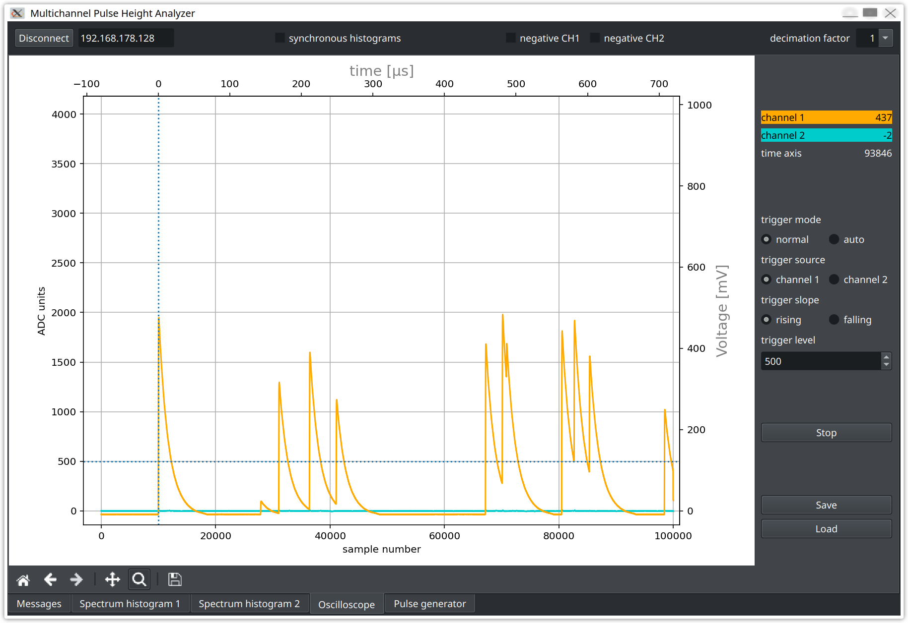

# redpitaya-daq

Data acquisition for the [RedPitaya FPGA board](https://redpitaya.com/de/)
for physics laboratory courses 

## Overview

The RedPitaya is a small, credit-card sized single board computer with a dual-core ARM Cortex-A processor 
and a XILINX Zynq 7010 FPGA. The board contains two fast ADCs and two DACs with 14 bit resolution running
at a sampling frequency of 125 MHz. Extension connectors provide general purpose IO pins with slow analog
inputs and outputs and support for serial bus interfaces like I²C, SPI and UART. 
The system runs under Linux, which provides network access and supports a wide range of
applications running on the board. 

Many laboratory instruments like oscilloscopes, logic analyzers, Bode plotters or a multi-channel
pulse-height analyzer can be realized on this board by simply changing the FPGA image and the
Linux application. 

{width=800px}
 
The MCPHA application for the RedPitaya by Pavel Demin provides a multi-channel pulse-height analyzer
as well as an oscilloscope capable of transferring large data rates reaching the theoretical
limit of the one-Gbit ethernet port. The package consists of an FPGA image and a server process
running on the RedPitaya board. A client script controls the server and pulls the data to the client
computer.

This package extends the original client by a possibility to record or export waveform data and
provides helper scripts to read back and analyze the recorded data. An interface to the buffer
manager *mimoCoRB* for buffering and parallel processing of large date volumes is also provided.

This package is in use for gamma-ray spectroscopy experiments in physics laboratory courses at
the Faculty of Physics at Karlsruhe Institute of Technology.

### Files:

  - *README.md*         this documentation 
  - *redPdaq.py*        client for data-acquisition using the mcpha server
  - *examples/*         recorded spectra
  - *examples/peakFitter.py* code to find and fit peaks in spectum data
  - *read_npy.py*       a simple example to read waveforms saved in *.npy* format
  - *redP_mimocorb.py*  runs *redPdaq* as a client of the buffer manager *mimoCoRB*
  - *setup.yaml*        coniguration script defining the *mimoCoRB* application
  - *modules/* and *config/* contain code and configuration files for the *redP_mimoCoRB* application
  - *rpControl.ui*      main qt5 window for *redPdaq*   
  - *mcpha_log.ui*      qt5 tab for message display
  - *mcpha_hst.ui*      qt5 tab for histogram display 
  - *mcpha_daq.ui*      qt5 tab for oscilloscope with daq mode
  - *mcpha_gen.ui*      qt5 tab for generator 
  - *RP-image/*         directory with all files necessary to boot a RedPitaya and start the server
                        application based on the "small, simple and secure" linux distribution
    [alpine-3.18-armv7-20240204](https://github.com/pavel-demin/red-pitaya-notes/releases/tag/20240204) 
  - utility scripts in the sub-directory *helpers/*

## Credit:

The code provided here is based on a fork of the sub-directory *projects/mcpha* in
a project by Pavel Demin, [red-pitaya-notes](https://pavel-demin.github.io/red-pitaya-notes).  
*redPdaq.py* contains an extension of the original oscilloscope class enabling fast restart
and data export.  

# Users' Guide

This section presents a brief introduction to the basic usage of the funcionality provided
by the *rediptaya-daq* package.

## Multi-Channel Pulse-Height Analyzer and Data recorder for the RedPitaya FPGA board

A multi-channel pulse-height analyzer produces a histogram of the heights of pulses present
in a signal supplied to the input. The MCPHA project uses the FPGA on the RedPitaya board to
process the digitized input signal at very high rates. A server process on the ARM processor
of the RedPitaya communicates with a client process via network. The client communicates with
the server, starts and stops data recording and receives and displays the data. The client is
also responsible for saving data to files. 

The original version by Pavel Demin has been modified to better meet the usual standards for
graphics displays in physics. A command line interface has also been added to allow easy control
of important parameters at program start. An extended  version of the original oscilloscope
display permits fast transfer of data to the client for data acquisition applications.

### Basic functionality 

The algorithm implemented in the FPGA  uses a rather simple, but straight-forward algorithm to
determine the pulse-heights.  When the signal voltage of a supplied input signal starts rising,
the corresponding  ADC count is stored. A second ADC value is stored when the signal level starts
falling again, and the difference of these two ADC values is histogrammed. The histogram is
transferred to the client upon request. 

The client application also contains a signal generator that runs independently and parallel to the
pulse-height analyzer. It provides exponential signals on the *out1* connector with configurable width
and rate. It is possible to generate pulses according to a Poisson process with a given average rate,
allowing to study effects of overlapping pulses (pile-up). Connecting *out1* with a (short) cable to
one or both of the inputs *in1* or *in2* provides input signals that can be be used to familiarize
with the functionality and to benchmark the performance. 

An oscilloscope with very basic functionality to set the trigger level and direction is also provided.
The timing is controlled by the so-called decimation factor that can be adjusted using the control
in the upper right corner of the graphical window. The RedPitaya samples data at a constant rate
of 125 MHz, and the decimation factor determines how many samples are averaged over and stored
in the internal ring buffer. This reduces the effective sampling rate accordingly. Only decimation
factors corresponding to powers of two are allowed. An example of randomly occurring exponential
signal pulses at an average rate of 10 kHz with a fall time of 10 µs is shown below; there is significant 
signal overlap in this case, making pulse-height detection more complex.

{width=800px}

A spectrum of such pulses is shown below for input pulses at multiples of 62.5 mV between 62.5 mV 
and 500 mV. The overlap of signal pulses leads to wrong pulse-height assignments below the actual 
voltage  and to entries above 500 mV when pulses become indistinguishable and therefore add up
to a single detected pulse. 

{width=800px}

Note that spectra and waveforms are plotted with a very large number of channels, well exceeding
the resolution of a computer display. It is therefore possible to use the looking-glass button
of the *matplotlib* window to mark regions to zoom in for a detailed inspection of the data. 

## Oscilloscope and data recorder

The original oscilloscpe display is extended by a "*Start DAQ*" button to run the oscilloscope in
data acquisition mode, i.e. continuously. Only a subset of the data is shown in the oscilloscope
display, together with information on the trigger rate and the transferred data volume. A configurable
user-defined function may also be called to analyse and store the recorded waveforms. 
It is possible to transfer data over a one-Gbit network from the RedPitaya with a rate of up
to 50 MB/s or about 500 waveforms/s.

An examples of call-back functions callable from within redPdaq is provided with the package

  - redP_consumer()            
      calculates and displays statistics on trigger rate and data volume.

### Running redPdaq as a mimoCoRB client  

*redP_mimocorb.py* is a script containing code to be started from the command line and
a function definde in the script, *redP_to_rb*, is called as a sub-process within the
*mimiCoRB* buffer manager frame-work for more advanced data analysis tasks requiring
multiple processes running in parallel.
A *mimoCoRB* setup-file is also provided and can be started by typing
`redP_mimoCoRB.py setup.yaml` on the command line. Modules and configuration
files for a pulse-height analysis of recorded signals are contained as exampless
in the sub-directories *modules/* and *config/*, respectively.

# Installation of the Package

The sub-directory *RP-image* contains the necessary files to be transferred to a SD card
for the RedPitaya board. Proceed as follows:

  - copy the contents of the directory *RP-image* to an empty SD card formatted as VFAT32;
  - connect the RedPitaya to the network via the LAN port; 
  - insert the SD card in the RedPitaya and connect the power. 

The RepPitaya directly starts the *mcpha* server application, requests an IP address via DHCP
and waits for the client program to connect via network.

On the client computer, download the client software:  

  - clone the *redpitaya-daq* repository via `git clone https://gitlab.kit.edu/guenter.quast/redpitaya-daq`;
  - change directory to the installation directory and start the application program *redPdaq.py*

This client program takes care of initializing the processes on the RedPitaya board through
the server, initiates data transfers from the RedPitaya board to the client computer and
provides several tabs to visualize data, generate test pulses and to store the acquired spectra
or waveforms. 

### Network connection to the RedPitaya Board

Connecting  to the RedPitaya with a LAN cable is the recommended way of access.  The RedPitaya 
requests an ip-address via the dhcp protocol and becomes accessible under the name *rp-xxxxxx*, 
where *xxxxxx* are the last six characters of the ethernet MAC address. 

If a usb-to-ethernet adapter is used and a dhcp server on the client computer is enabled for the
interface, a one-to-one connection of the RedPitaya to a host computer can easily be established;
use the name *rp-xxxxxx.local* in this case. How to set up a *dhcp* server for a usb-to-ethernet
adapter depends on the operating system used on the client computer; please check the relevant 
documentation for your system. 

## Usage

First, boot the RedPitaya with the proper SD card inserted. This starts the FPGA code
and the server process on the RedPitaya board. 

Then, on the client side:

  - start the client program from within a terminal via `python3 redPdaq.py`; 

  - in the graphical interface, enter the network address of the RedPitaya in the 
    field next to the orange button and click *connect*; 
    watch out for connection errors in the *Messages* tab!
    The message "*IO started*" is displayed if everything is ok, and the address turns green;
    
  - click the *oscilloscope* tab, check the trigger level and then start the oscilloscope
    to see whether signals are arriving at one or both of the RedPitaya inputs;
    adjust the *decimation factor* in the top-right corner of the main display to ensure
    that the sampling rate is high enough for about 50 samples over the pulse duration. 
  - if no signal source is available, you may click the *generator* tab, set the desired
    signal parameters and start the generator; connect *out1* of the RedPitaya to one of  
    rhe inputs with a (short) cable and then check for the presence of signals in
    the *oscilloscpe* tab;
    
  - now click the tab *spectrum histogram 1*; adjust the amplitude threshold and time
    of exposure, then click the *Start* button and watch the spectrum building up;
  - if running `redPdaq.py`, threre is a buttton "StartDQQ"; click it to cintinuously transfer
    waveform data to the client computer. If a filename was specified, data is recorded to disk
    in *.npy* format; note that any active spectrum rab is put in paused mode if DAQ is active.

  - when finished, use the *Save* button to save the spectrum to a file with a 
    meaningful name.

## Helper scripts

The directory *helpers/* contains helper scripts to read and visualize data from
files written by *mcpha.py*, for both spectrum histograms and exported waveforms.
Note that presently mcpha.py exports data in human-readable format using 
*numpy.savetxt()*.

 >  *generate_spectrum_input.py*  is a script to to generate input spectra for the signal 
    generator of mcpha.py The convention is to use 4096 channels for a range from 0 to 500 mV.
    Pulse heights are drawn randomly from this spectrum, and pulses are formed according to the
    frequency and the rise and fall times specified in the graphical interface. The signals are 
    available at the *out1*  connector of the RedPitaya board.   
 >    
 >  Pulses can be generated at a fixed frequency, or with random timing corresponding to a 
    Poisson process with a mean pulse rate given by the chosen frequency. The latter option is 
    useful to study "pile-up" effects from overlapping pulses. 

 >  *read_hst.py*  illustrates how to read and plot spectrum data exported by mcpha.py.

 >  *read_osc.py* demonstrates how to read and plot waveform data exported from the 
    oscilloscope tab of mcpha.py.

>  *read_npy.py*  illustrates how to read waveform recorded by `redPdaq.py`.

## Examples

The directory *examples/* contains some spectra recorded with *redPdaq.py* and the Python
program *peakFitter.py* to find and precisely fit peaks in recorded spectra. An example is
shown here:

{width=800px}

## License

Like the original code by Pavel Demin, this open-source code is provided under the MIT License. 

## Project status

This project has been developed for experiments in the physics lab courses at the Faculty of Physics
at Karlsruhe Institute of Technology. The code is already public, but presently still under test. 
